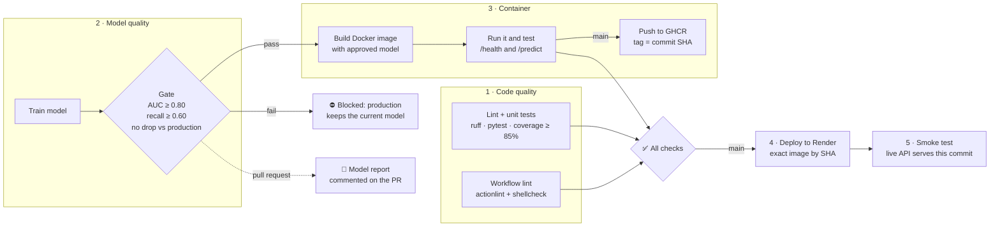

# Churn Guard

[](https://github.com/OWNER/REPO/actions/workflows/pipeline.yml)

**A customer-churn prediction API, shipped by a CI/CD pipeline with a model-quality gate.** It predicts how likely a subscription customer is to cancel, and explains why.

> **A worse model never reaches production.** Every change retrains the model and compares it with the one in production. If accuracy drops, the pipeline stops: no image is built, nothing is deployed, and the live API keeps serving the current model.

**Live API:** _add your Render URL here_ (interactive docs at `/docs`)

---

## The CI/CD pipeline



| Stage | What it guarantees |
|---|---|
| **1 · Lint & unit tests** | Code style, 25 tests covering data, model, gate and API |
| **1 · Workflow lint** | The pipeline files themselves are valid (actionlint + shellcheck) |
| **2 · Train & model-quality gate** | The new model meets minimum AUC/recall **and** is not worse than production. On PRs, a comparison table is posted as a comment. |
| **3 · Docker build & test** | The image starts, reports the right commit and returns a sensible prediction *before* it is pushed |
| **4 · Deploy to Render** | Production runs the exact image that was tested, pinned by commit SHA |
| **5 · Smoke test** | The live URL is serving the new commit and answering predictions |

Also included: Dependabot (pip, Docker and Actions updates, each re-validated by the gate), concurrency control, least-privilege tokens, a non-root container with a health check, and multi-stage Docker builds.

### Model report on every pull request

| Metric | Production | This change | Δ |
|---|---|---|---|
| auc | 0.824 | 0.744 | 🔴 -0.080 |
| recall | 0.796 | 0.694 | 🔴 -0.102 |

❌ AUC dropped from 0.824 (production) to 0.744, more than the allowed 0.01. **Deployment blocked.**

## The model

- **Data:** 6,000 subscription customers (`data/customers.csv`, reproducible with `python -m churn.data`). Features are tenure, monthly bill, support tickets, logins, late payments, contract, payment method and plan. Churn rate is 34%.
- **Algorithm:** logistic regression with scaling and one-hot encoding. It was chosen because every prediction can be **explained**: the API returns the top reasons.
- **Current performance:** AUC 0.824, recall 0.796 (the baseline is in [models/baseline_metrics.json](models/baseline_metrics.json)).

## API

| Method | Path | Description |
|---|---|---|
| `GET` | `/` | Web page to try predictions |
| `GET` | `/health` | Status, commit, model version and AUC |
| `POST` | `/predict` | Churn probability, risk band and top reasons |
| `GET` | `/docs` | Interactive OpenAPI docs |

```bash
curl -X POST https://<your-app>.onrender.com/predict \
  -H "Content-Type: application/json" \
  -d '{"tenure_months":4,"monthly_charges":89,"support_tickets":3,"logins_last_30d":2,
       "late_payments":1,"contract":"month-to-month","payment_method":"invoice","plan":"premium"}'
```
```json
{"churn_probability":0.972,"risk":"high",
 "top_factors":["month-to-month contract","many support tickets","short time as a customer"],
 "model_version":"a1b2c3d"}
```

## Run it locally

```bash
python -m venv .venv && source .venv/bin/activate   # Windows: .venv\Scripts\activate
pip install -e ".[dev]"
ruff check . && pytest --cov          # lint + tests
python -m churn.train                 # train -> models/model.joblib
python -m churn.gate                  # model-quality gate
uvicorn churn.api:app --reload        # http://localhost:8000

# or in Docker, exactly as in production:
docker build -t churn-guard . && docker run -p 8000:8000 churn-guard
```

## Project layout

```
src/churn/
  config.py      features, paths, gate thresholds
  data.py        synthetic customer data
  features.py    model definition + per-prediction explanations
  train.py       training + metrics
  gate.py        model-quality gate (vs thresholds and production baseline)
  api.py         FastAPI app
  static/        web page
tests/           data, model, gate and API tests
models/          baseline_metrics.json (committed); model.joblib is built in CI
Dockerfile       multi-stage, non-root, health check
.github/         pipeline, Dependabot, PR template
docs/            SETUP.md (one-time setup), DEMO.md (showcase script)
```
